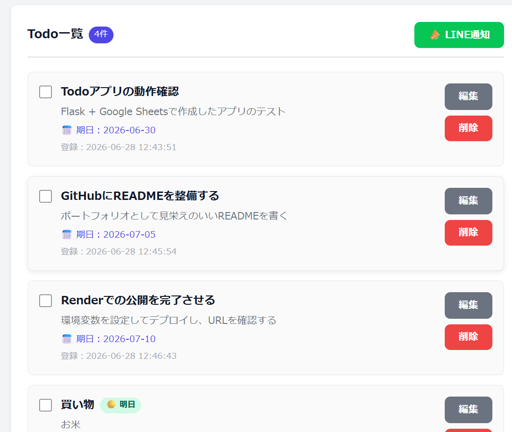
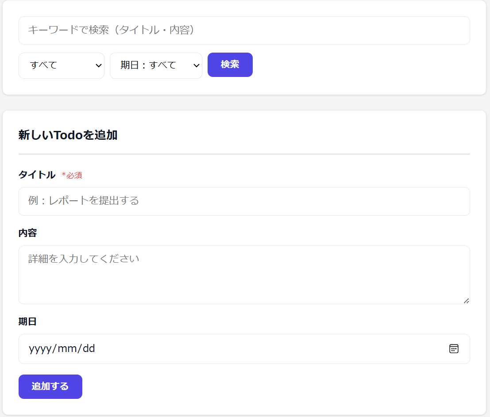
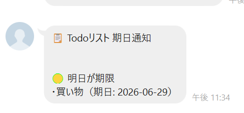

# 📝 Todo リスト Web アプリ


<br>

## 概要

**Python（Flask）と Google スプレッドシートを組み合わせた Todo 管理 Web アプリです。**

タスクの「タイトル・内容・期日」を登録・編集・削除でき、データはリアルタイムで Google スプレッドシートに保存されます。データベース不要で動作し、スプレッドシートを開けばデータを直接確認・編集することもできます。

**公開URL（Render）:** https://todo-app-1p8e.onrender.com

<br>

### Todo 一覧画面


### 検索・フィルター画面


### LINE 通知


<br>

---

## 何ができるか

| 機能 | 説明 |
|---|---|
| ✅ **Todo 登録** | タイトル・内容・期日を入力して新しいタスクを追加 |
| 📋 **Todo 一覧表示** | 登録したすべての Todo をカード形式で確認 |
| ✏️ **Todo 編集** | タイトル・内容・期日をあとから変更 |
| 🗑️ **Todo 削除** | 確認ダイアログ付きで削除 |
| ☑️ **完了 / 未完了管理** | チェックボックスで完了状態を切り替え。完了済みは取り消し線で表示 |
| 🔍 **検索・フィルター** | キーワード検索 / 完了ステータス / 期日（期限切れ・今日・明日）で絞り込み |
| 📣 **LINE 通知** | 期日が近い未完了 Todo を LINE にプッシュ通知 |
| 💾 **スプレッドシート保存** | 全操作がリアルタイムで Google スプレッドシートに反映 |

<br>

---

## 使用技術

| カテゴリ | 技術・ツール | 用途 |
|---|---|---|
| 言語 | Python 3.12 | バックエンド全般 |
| フレームワーク | Flask 3.0 | Web アプリ構築・ルーティング |
| データ保存 | Google Sheets API / gspread | スプレッドシートの読み書き |
| 認証 | google-auth（サービスアカウント） | Google API への安全な接続 |
| 環境変数管理 | python-dotenv | API キー等の秘密情報を管理 |
| LINE 通知 | LINE Messaging API / requests | プッシュ通知の送信 |
| 本番サーバー | gunicorn | Render 上でのアプリ起動 |
| デプロイ | Render | 無料で Web アプリを公開 |
| フロントエンド | HTML5 / CSS3 | 画面の構築とデザイン |

<br>

---

## システム構成

```
ブラウザ（ユーザー）
      │
      │  HTTP リクエスト（GET / POST）
      ▼
Flask アプリ（Render 上で稼働）
      │                    │
      │ gspread 経由        │ requests 経由
      ▼                    ▼
Google スプレッドシート   LINE Messaging API
（データ保存先）          （プッシュ通知）
```

<br>

---

## ディレクトリ構成

```
todo-app/
├─ app.py                # Flask アプリ本体（ルーティング・API 連携）
├─ requirements.txt      # 依存ライブラリ一覧
├─ .env.example          # 環境変数のテンプレート
├─ .gitignore
├─ templates/
│  ├─ index.html         # 一覧・検索・登録フォームページ
│  └─ edit.html          # 編集ページ
└─ static/
   └─ style.css          # スタイルシート
```

<br>

---

## セットアップ方法

### 前提条件

- Python 3.10 以上
- Google アカウント
- （LINE 通知を使う場合）LINE Developers アカウント

<br>

### Step 1: リポジトリをクローン

```bash
git clone https://github.com/moedaichi0629-ai/todo-app.git
cd todo-app
```

<br>

### Step 2: Google Cloud でサービスアカウントを作成

1. [Google Cloud Console](https://console.cloud.google.com/) でプロジェクトを作成
2. 「API とサービス」→「ライブラリ」から **Google Sheets API** と **Google Drive API** を有効化
3. 「認証情報」→「サービスアカウント」を作成
4. 「キー」タブから JSON キーをダウンロードし、**`credentials.json`** にリネームしてプロジェクトルートに配置

<br>

### Step 3: Google スプレッドシートを準備

1. [Google スプレッドシート](https://sheets.google.com) で新しいシートを作成
2. `credentials.json` 内の `client_email` をコピー
3. スプレッドシートの「共有」から、そのメールアドレスを **編集者** として追加
4. URL からスプレッドシート ID を取得：  
   `https://docs.google.com/spreadsheets/d/`**`【この部分が ID】`**`/edit`

> **注意：** ヘッダー行の作成やカラム追加はアプリが自動で行います。シートに何も書く必要はありません。

<br>

### Step 4: 環境変数を設定

```bash
cp .env.example .env
```

`.env` を開いて以下を入力：

```env
# 必須
SPREADSHEET_ID=取得したスプレッドシート ID
SECRET_KEY=任意の文字列（例：mysecretkey123）

# LINE 通知を使う場合（オプション）
LINE_CHANNEL_ACCESS_TOKEN=LINE チャネルアクセストークン
LINE_USER_ID=通知先の LINE ユーザー ID
```

<br>

### Step 5: ライブラリをインストール

```bash
pip install -r requirements.txt
```

<br>

### Step 6: ローカルで起動する

```bash
python app.py
```

ブラウザで **http://localhost:5000** を開いて動作確認してください。

> `* Running on http://127.0.0.1:5000` と表示されたら起動成功です。  
> 終了するには `Ctrl + C` を押してください。

<br>

---

## LINE 通知の設定方法

1. [LINE Developers](https://developers.line.biz/) にログインしてプロバイダーとチャネルを作成
2. チャネルの種類は **「Messaging API」** を選択
3. 「Messaging API 設定」タブから **チャネルアクセストークン** を発行してコピー
4. [LINE Official Account Manager](https://manager.line.biz/) でチャネルを「応答モード：Bot」に設定
5. 自分の LINE アカウントで作成した Bot を友だち追加
6. 友だち追加後、[このツール](https://manager.line.biz/) または LINE Developers のコンソールで **ユーザー ID** を確認
7. `.env` に `LINE_CHANNEL_ACCESS_TOKEN` と `LINE_USER_ID` を設定

通知対象は「**未完了かつ期日が今日・明日・期限切れ**」の Todo です。  
一覧画面の「📣 LINE通知」ボタンを押すと即時送信されます。

<br>

---

## Render へのデプロイ手順

1. GitHub にプッシュ
2. [Render](https://render.com/) で「New +」→「Web Service」→ リポジトリを選択
3. 以下を設定：

| 項目 | 設定値 |
|---|---|
| Runtime | Python 3 |
| Build Command | `pip install -r requirements.txt` |
| Start Command | `gunicorn app:app` |

4. 「Advanced」→「Add Environment Variable」で以下を追加：

| キー | 値 |
|---|---|
| `SPREADSHEET_ID` | スプレッドシート ID |
| `SECRET_KEY` | 任意の文字列 |
| `GOOGLE_CREDENTIALS_JSON` | `credentials.json` の中身をすべてコピーして貼り付け |
| `LINE_CHANNEL_ACCESS_TOKEN` | LINE チャネルアクセストークン（LINE 通知を使う場合） |
| `LINE_USER_ID` | 通知先の LINE ユーザー ID（LINE 通知を使う場合） |

5. 「Create Web Service」でデプロイ開始  
   `==> Your service is live 🎉` と表示されたら完了

<br>

---

## 動作確認手順

### ローカル起動後の確認

| 確認項目 | 手順 |
|---|---|
| Todo 登録 | フォームにタイトルを入力して「追加する」→ 一覧に表示されること |
| 完了チェック | チェックボックスをクリック → 取り消し線が表示されること |
| 検索 | キーワードを入力して「検索」→ 該当 Todo だけ表示されること |
| フィルター | 「未完了のみ」「期限切れ」などを選択して絞り込めること |
| LINE 通知 | 「📣 LINE通知」ボタン → LINE にメッセージが届くこと |
| スプレッドシート | Google スプレッドシートを開き、データが反映されていること |

<br>

---

## 今後追加予定の機能

- [x] 完了 / 未完了チェック機能
- [x] 検索・フィルター機能（キーワード / ステータス / 期日）
- [x] LINE 通知機能
- [ ] 優先順位設定（高・中・低）
- [ ] 期日順・登録日順での並び替え
- [ ] ログイン機能（ユーザーごとに Todo を管理）
- [ ] モバイル向け UI のさらなる改善

<br>

---

## 工夫した点

**ローカルと本番で認証方法を自動切り替え**  
ローカルでは `credentials.json` ファイルを使い、Render では `GOOGLE_CREDENTIALS_JSON` 環境変数（JSON 文字列）を使う仕組みにしました。秘密鍵を Git に含めずに安全にデプロイできます。

**既存データを守るシート移行処理**  
`status` 列が存在しない旧シートへの移行時、シート全体を消すのではなく不足列だけを右端に追記し、既存行には自動で `incomplete` を設定します。データが消えません。

**期日ステータスの自動計算**  
各 Todo に `due_status`（overdue / today / tomorrow / upcoming）を動的に付与し、バッジ表示・フィルター・LINE 通知対象の判定に活用しています。

<br>

---

## ライセンス

MIT License
